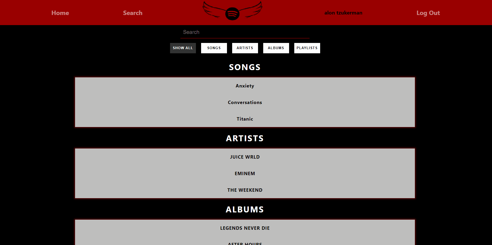

# SPOTIFLY - MUSIC APP

### REGISTER & LOGIN 

### SEARCH

### MAIN

### ERD

### TECH USED
    1. NODEJS+EXPRESS
    2. REACT
    3. MYSQL
    4. ORM
    5. ANALYTICS

### SETUP
    1. Clone this repository on your computer and open it.
    2. Run `npm install` to install all required dependencies.
    3. Start the server with `npm start`.
        *Default: Running server on PORT 3001.
    4. Run `cd client` to get inside the client folder.
    5. Run `npm install` to install all required dependencies.
    6. Start the app with `npm start` (BE SURE YOU ARE IN THE CLIENT FOLDER)
        *Default: Running app on PORT 3000, and moves to 3001 with PROXY.
    

### ENJOY !
